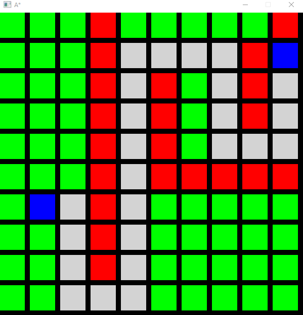

# A* Implementation  
Finding dynamically shortest path between two nodes demo included(demo.mp4) 

Technologies used: C++, SDL, Artificial Intelligence 
Right click for start node 
Left Click for end node 
CTR+Left click for obstacle  

