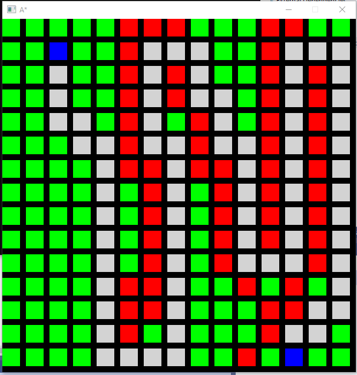

# AstarImplementation
Finding dynamically shortest path between two nodes
Technologies used: C++, SDL, Artificial Intelligence
Right click for start node
Left Click for end node
CTR+Left click for obstacle

